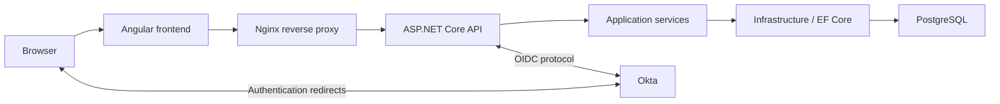
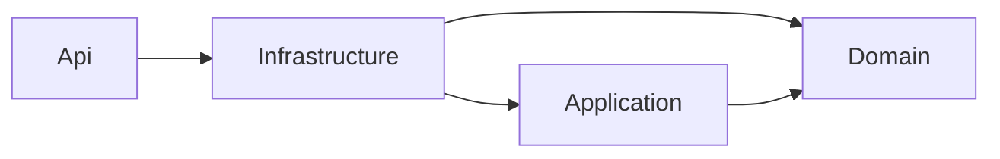
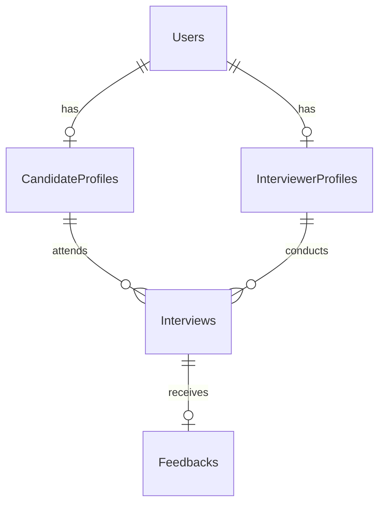

# Architecture Overview

Mock Interview is an Angular 19 application with an ASP.NET Core 9 API and PostgreSQL persistence. Interviewers manage candidates, interview sessions, feedback, and reports. Candidates view their own interviews, feedback, and progress. Okta is the external authentication provider and source of application role membership.

This document describes the checked-in implementation, not a verified inventory of running cloud resources. See [HOW-IT-WORKS.md](HOW-IT-WORKS.md) for request and user flows.



The diagram represents the frontend-container proxy path. Angular executes in the browser; Nginx serves its static build and can forward API requests. There are two important routing variations:

- **GKE manifests:** `k8s/ingress.yaml` sends `/api`, `/signin-oidc`, and `/signout-callback-oidc` directly to the API service. Other paths reach the frontend service. Thus API requests through this ingress bypass frontend Nginx.
- **Local Angular development:** `frontend/proxy.conf.json` proxies `/api` to `http://localhost:5207`; this path uses the Angular development server rather than Nginx.

The API deployment declares a Cloud SQL Auth Proxy sidecar at localhost port 5432 and selects Google Secret Manager for database-password and Okta-client-secret retrieval. The other startup configuration branch reads the connection string and client secret through ASP.NET configuration. These are deployment configurations, not evidence of live service availability.

# Backend Architecture

The four production projects separate HTTP delivery, use cases, persistence, and domain data. `InterviewPractice.Tests` is a separate test project.

| Project | Responsibility and important contents | Direct project dependencies |
|---|---|---|
| `InterviewPractice.Domain` | Entities `User`, `CandidateProfile`, `InterviewerProfile`, `Interview`, `Feedback`; role, experience, type, status, and outcome enums | None |
| `InterviewPractice.Application` | `CandidateService`, `InterviewService`, `FeedbackService`, `ReportService`, `CurrentUserService`; interfaces, DTOs, request validation, typed exceptions, `IApplicationDbContext` | Domain |
| `InterviewPractice.Infrastructure` | `ApplicationDbContext`, EF entity configurations, PostgreSQL provider, migrations, design-time context factory, `DevelopmentDataSeeder` | Application and Domain |
| `InterviewPractice.Api` | Controllers, cookie/OIDC setup, authorization policies/handler, exception handler, dependency registration, startup migration/seed orchestration | Infrastructure; Application and Domain are available transitively |

Actual compile-time project references:



Runtime calls differ from project-reference direction: controllers call Application services, which use `IApplicationDbContext`; dependency injection supplies Infrastructure's `ApplicationDbContext`. The interface exposes EF `DbSet` properties and `SaveChangesAsync`. Application therefore depends on EF Core and performs LINQ/async EF queries itself. This is a pragmatic layered design, not a persistence-library-independent domain/use-case implementation. There is no repository layer or mediator.

Controllers handle routing, HTTP results, request identity extraction where needed, and delegation. They do not query EF directly. For example, `CandidateSelfController` delegates profile lookup, interview retrieval, and progress calculation to Application services; `InterviewsController` calls `CreateForUserAsync` to resolve the current interviewer. `Program.cs` is the composition root and necessarily knows Infrastructure for database registration and startup migration execution.

# Frontend Architecture

Angular uses standalone components, reactive forms, `HttpClient`, RxJS, and signals for the current user and root access-error state.

```text
frontend/src/app/
  core/
    guards/          home.guard, candidate.guard, interviewer.guard
    models/          user.model
    services/        AuthService
    interceptors/    authErrorInterceptor
    utils/           apiErrorMessage, nonBlank, integer, fieldError
  features/
    auth/pages/login/
    interviewer/
      dashboard/ candidates/ interviews/ feedback/ reports/
    candidate/
      dashboard/ interviews/ progress/ services/
  layout/
    header/ main-layout/ sidebar/
  app.routes.ts
  app.config.ts
```

Feature folders hold their pages and, where needed, HTTP services and models. `CandidatePortalService` is shared by the Candidate pages. Shared validation/error functions live under `core/utils`; there is no separate notification framework.

`/login` is a public top-level route outside `MainLayoutComponent`, with no authentication guard. The application layout contains `/`, the Interviewer routes (`/dashboard`, `/candidates`, `/interviews`, `/reports` and their detail/form routes), and Candidate routes (`/my-dashboard`, `/my-interviews`, `/my-interviews/:id`, `/my-progress`).

`homeGuard` chooses the dashboard. The two role guards allow their role and redirect the other role to its dashboard. They use cached `AuthService.currentUser` when available and otherwise request `/api/auth/me`. A 401 goes to Angular `/login`; other failures cancel navigation and populate the root error state. Route guards provide navigation UX, not the security boundary.

`authErrorInterceptor` handles 401 responses from relative `/api/` requests by navigating to `/login`. It excludes `/api/auth/me`, whose caller handles the session-check outcome. It does not initiate Okta login. `LoginComponent` starts that flow only after the explicit button click.

# Authentication and Authorization Architecture

The backend implements BFF-style authentication: Angular does not implement OIDC, store tokens in local storage, or attach bearer tokens. Browser requests use the authentication cookie, with feature HTTP calls specifying `withCredentials: true`.

Relevant implementation: [Program.cs](../backend/InterviewPractice.Api/Program.cs), [AuthController.cs](../backend/InterviewPractice.Api/Controllers/AuthController.cs), [CurrentUserService.cs](../backend/InterviewPractice.Application/Auth/CurrentUserService.cs), and [UserRoleAuthorizationHandler.cs](../backend/InterviewPractice.Api/Authorization/UserRoleAuthorizationHandler.cs).

- `GET /api/auth/login` explicitly challenges the OpenID Connect scheme. `ResponseType = "code"` selects Authorization Code flow.
- Okta returns to `/signin-oidc`, handled by authentication middleware, not an MVC controller.
- The OIDC handler uses configured authority/client credentials, requests `openid`, `profile`, and `email`, and enables the UserInfo endpoint. `SaveTokens = true` saves tokens in authentication properties. No custom server-side ticket store is configured; this should not be described as a separate server token vault.
- The cookie is named `InterviewPractice.Auth`, is HttpOnly, uses SameSite Lax, and has `SecurePolicy = SameAsRequest`. HTTPS/forwarded-request configuration therefore matters.
- Cookie challenges and access-denied results under `/api` produce 401 and 403 rather than browser redirects to Okta.
- `GET /api/auth/me` requires authentication, resolves the local user, and returns user/profile identifiers and the role string (`Candidate` or `Interviewer`).
- `GET /api/auth/logout` signs out both Cookie and OIDC schemes. `/signout-callback-oidc` is middleware-managed. Both login and logout use `Frontend:BaseUrl` as their final redirect destination; Angular then selects the dashboard or login page.

## Identity and local role synchronization

`CurrentUserService.GetOrLinkAsync` consumes identity claims and the `groups` claims already present in the request principal. It does not call the Okta management API.

1. Missing identity/email is rejected. Incoming email is trimmed and lowercased invariantly.
2. Group matching is case-insensitive: `Candidates` maps to Candidate and `Interviewers` to Interviewer. Exactly one of these memberships is required. Both or neither is rejected; unrelated groups do not assign a role.
3. Lookup first uses `OktaUserId`. An email fallback may link only a placeholder with the exact `pending-`, `dev-`, or `demo-` prefix followed by a GUID in D format.
4. A matching email belonging to a different real Okta identity is rejected without overwriting that identity. New local users can be created when neither lookup matches.
5. The local `User.Role` is synchronized to the role resolved from claims, and the active role's missing profile is created. Existing profiles and interview history are retained, allowing one user to have both profile records over time.
6. Name synchronization occurs when linking a placeholder; an already-linked user is not unconditionally updated from every email/name claim.

`OktaUserId` is an EF concurrency token. A concurrency failure during linking is rejected rather than retried by email. Unique constraints also protect identity and profile records.

Both `Candidate` and `Interviewer` authorization policies require authentication plus a `UserRoleRequirement`. The authorization handler uses this same service and checks its resolved role. It does not authorize solely from a stale database role. However, group changes at Okta are only observed when updated claims reach the principal: no per-request live Okta group refresh is implemented. Cookie claims and the Angular user cache may outlive an external group change.

# Application / Business Layer

| Service | Use cases and rules |
|---|---|
| `CandidateService` | List/search/read/create/update candidates and resolve a profile by Okta identity. Creation normalizes email, rejects an existing email, and creates a local pending identity plus profile; it does not provision an Okta account. |
| `InterviewService` | List/filter/read interviews, resolve current interviewer on creation, validate candidate/interviewer existence, update details, complete sessions, and filter Candidate-owned reads. |
| `FeedbackService` | Read feedback and create one feedback record for an existing Completed interview. Reject duplicates and other interview states. |
| `ReportService` | Calculate overview counts/average scores and candidate-specific progress from stored interviews/feedback. No report tables are used. |
| `CurrentUserService` | Link/authenticate local identity context and synchronize application role/profile presence from claims. |

Request and response DTOs keep HTTP payloads separate from EF entities. Examples are `CreateInterviewRequest`, `InterviewDetailsDto`, and `CandidateInterviewDetailsDto`, whose optional feedback is explicitly modeled.

`ResourceNotFoundException` represents missing resources in creation workflows. Some read/update methods instead return null/false and controllers return `NotFound()`. `BusinessConflictException` represents duplicate candidate email, duplicate feedback, feedback before completion, editing a Completed interview, or completing a Cancelled interview.

Creating an interview sets Scheduled. Scheduled/InProgress interviews can be completed; completion of an already Completed interview succeeds without another state change. Cancelled cannot become Completed. **There is no cancel action/endpoint or start-interview action in the current application**, although Cancelled and InProgress are enum values and are understood by reads. Update requests do not expose Status.

# Validation and Error Handling

| Boundary | Implemented responsibility |
|---|---|
| Angular forms | Required/nonblank text, numeric selections, integer score/duration and ranges, string lengths, inline errors and pending-submission protection; early UX feedback |
| ASP.NET request boundary | `[ApiController]` automatic validation; DataAnnotations, `NonEmptyGuidAttribute`, and `IValidatableObject` on interview DTOs |
| Application services | Existence, duplicate checks, permitted business operations and ownership filtering |
| PostgreSQL | PK/FK/unique/NOT NULL/length/CHECK enforcement, including competing writes |

Request validation includes duration 15–240, score 1–10, valid enum members, valid nonempty identifiers, required/nonblank text, email format, and a non-default UTC `ScheduledAt`. TargetRole is optional in the form but represented as an empty string rather than null. API string limits mirror the persistence lengths below. DTO validation occurs at the HTTP boundary; invoking services directly does not automatically execute ASP.NET validation.

`Program.cs` registers `AddProblemDetails`, one `ApiExceptionHandler`, and `UseExceptionHandler`. The handler returns `application/problem+json` with status, title, safe detail, and `traceId`. Unexpected exceptions are logged server-side and produce a generic 500 in both environments. Swagger is development-only; development API failures are not exposed as stack traces by this handler.

| Status | Meaning and implementation |
|---|---|
| 400 | Binding/request validation failure; MVC validation ProblemDetails carries field errors. |
| 401 | Missing authentication or required identity claims. Frontend goes to public login, without automatically challenging Okta. |
| 403 | Authenticated principal lacks valid role/access. No automatic login retry. Creating an interview without a current interviewer profile also returns Forbid. |
| 404 | Missing requested resource, or Candidate interview excluded by ownership filtering. |
| 409 | `BusinessConflictException` or a recognized PostgreSQL unique violation. |
| 500 | Unexpected failure; generic client message and server-side exception log. |

For PostgreSQL SQLSTATE `23505` wrapped in `DbUpdateException`, the handler recognizes `IX_Users_Email`, `IX_Feedbacks_InterviewId`, `IX_Users_OktaUserId`, `IX_CandidateProfiles_UserId`, and `IX_InterviewerProfiles_UserId`. Unrecognized database failures, including CHECK/FK failures, are not universally translated into 400/409; they reach the generic 500 branch.

Not every error originates in the exception handler: MVC validation and controller results have their own paths. Cookie-generated 401/403 can have empty bodies, and `AuthController` has explicit message responses. The frontend helper primarily uses HTTP status and does not assume every error is ProblemDetails.

# Persistence Architecture

`ApplicationDbContext` implements `IApplicationDbContext` and loads all entity configurations from the Infrastructure assembly. Npgsql maps EF operations to PostgreSQL. Services generally project read queries to DTOs with `AsNoTracking`, while updates load tracked entities and call `SaveChangesAsync`.

## Relationships and constraints

All five tables have a non-null UUID `Id` primary key. Services assign GUIDs; seed records use deterministic GUIDs. The migrations do not install database UUID-generation defaults. Enums use integers; `ScheduledAt` uses PostgreSQL `timestamp with time zone`.



| Foreign key | Required on dependent? | Unique? | Delete behavior |
|---|---|---|---|
| `CandidateProfiles.UserId` → `Users.Id` | Yes | Yes | Cascade from User |
| `InterviewerProfiles.UserId` → `Users.Id` | Yes | Yes | Cascade from User |
| `Interviews.CandidateId` → `CandidateProfiles.Id` | Yes | No | Restrict |
| `Interviews.InterviewerId` → `InterviewerProfiles.Id` | Yes | No | Restrict |
| `Feedbacks.InterviewId` → `Interviews.Id` | Yes | Yes | Cascade from Interview |

A User may have zero or one of each profile; an Interview may have zero or one Feedback. Each dependent's FK is required. Restricting profile deletion preserves referenced interviews, and can consequently block cascading deletion of a User with interview history. Role changes themselves delete nothing. The database does not constrain profile presence to equal the active role, which permits retained historical profiles.

| Table | Text constraints | CHECK constraints |
|---|---|---|
| Users | Required OktaUserId ≤100, Email ≤255, FirstName/LastName ≤100 | Role in 1,2; OktaUserId not entirely whitespace using an explicit character set |
| CandidateProfiles | Required TargetRole ≤150; empty allowed | ExperienceLevel in 1–4 |
| InterviewerProfiles | No additional text columns | None |
| Interviews | Required Title ≤200; optional Topics ≤1000 and Notes ≤2000 | Type in 1–3; Level and Status in 1–4; DurationMinutes >0 |
| Feedbacks | Required Strengths/ImprovementAreas ≤2000; optional AdditionalComments ≤3000 | Outcome in 1–4; OverallScore between 1 and 10 |

Other scalar/FK columns are non-null. Required database text is not a general nonblank check: API validation handles required meaningful text. The database duration constraint deliberately remains broader than the API's 15–240 rule. Feedback-after-completion and allowed status transitions are Application rules, not cross-table database checks.

Unique indexes cover `Users.Email`, `Users.OktaUserId`, both profile `UserId` columns, and `Feedbacks.InterviewId`. Ordinary FK indexes cover `Interviews.CandidateId` and `Interviews.InterviewerId`. There are no explicit Status/ScheduledAt/composite indexes. Email writers normalize with trim/lowercase; there is no second normalized email column, case-insensitive email type, or normalized-email CHECK.

## Migrations and seed lifecycle

The migrations are `20260923004050_InitialCreate` and `20260924042230_AddDomainIntegrityChecks`, with an EF model snapshot. Startup calls `Database.MigrateAsync` in local and deployed environments before serving requests. This requires database connectivity and suitable schema permissions; startup failures are not HTTP ProblemDetails responses.

`DevelopmentDataSeeder` runs only when the environment is Development **and** `SeedDemoData` is true. The checked-in GKE configuration selects Production and disables demo seeding. The seeder reconciles users/profiles/interviews/feedback individually, uses stable IDs and legacy matching, preserves existing values/real identities, and adds missing records. It uses one transaction, a PostgreSQL transaction advisory lock, one SaveChanges call, and commit. Conflicting seed matches fail rather than silently overwrite data; rollback permits a later retry. Existing feedback and edited interview states are respected.

# Important Design Decisions

- **Backend-managed authentication:** protocol handling and identity linking stay in ASP.NET; Angular only checks the session and offers explicit sign-in/sign-out actions.
- **Services between HTTP and persistence:** controllers remain focused on HTTP, while reusable use cases own queries and business rules. The existing EF-aware Application interface keeps this assignment small.
- **Two application areas over one candidate domain:** Interviewer candidate management and Candidate self-service are different views, not unrelated candidate types. Interviewer policies currently grant application-wide management, not an assigned-interviewer-only scope.
- **Centralized errors:** typed exceptions communicate expected application failures without repeated controller try/catch blocks. Unknown failures remain generic to clients.
- **Validation plus database integrity:** form checks improve UX, API checks protect the boundary, and database constraints arbitrate final integrity and uniqueness under concurrency.
- **Versioned schema:** migrations describe schema evolution instead of recreating databases. They currently execute during normal API startup.
- **Runtime frontend upstream:** `frontend/Dockerfile` installs `nginx.conf.template` under `/etc/nginx/templates/default.conf.template`. The Nginx image substitutes `API_UPSTREAM` at container startup. Kubernetes sets it to `mock-interview-api:80`; Angular keeps relative API URLs and does not need a rebuild for this proxy target. SPA fallback serves `index.html` for routes such as `/login`.

# Scope and Verification Limits

The repository specifies configuration, not live Okta claim mappings, allowed redirect URIs, cloud permissions, applied database migrations, or running deployment health. In particular, the code expects `groups` claims but the tenant's claim configuration is external. No claim-refresh polling is implemented.

The Nginx template forwards `X-Forwarded-Proto` from its own `$scheme`; API forwarded-header options clear trusted-network/proxy lists. Their suitability depends on the real proxy/trust boundary. Local Angular proxy configuration contains only `/api`, so callback routing depends on the registered backend callback origin. These deployment/authentication assumptions need runtime verification; this documentation makes no production-readiness or high-availability claim.

`GET /api/health` anonymously returns `{ "status": "Healthy" }`; it is a simple process endpoint, not a PostgreSQL/Okta readiness check. There is no implemented root `/health` route.

Potential later work such as cancellation, explicit claims refresh, relational/concurrency integration tests, or additional operational hardening is outside the implemented scope and is not implied by the diagrams.
