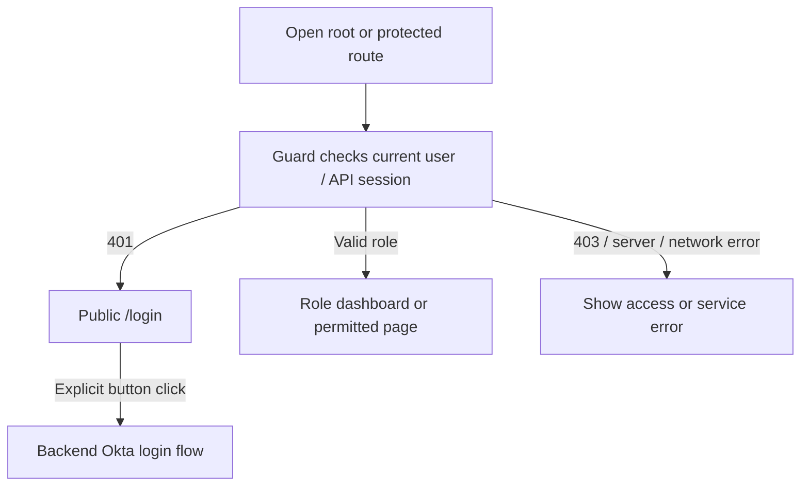
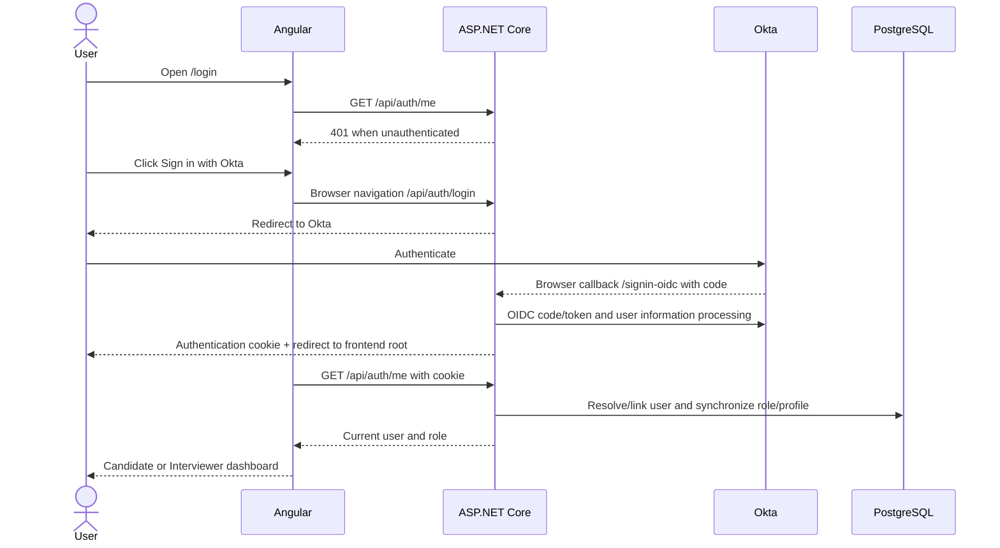

# How It Works

This guide follows the current implementation from browser actions to persistence. For project dependencies and the relational model, see [ARCHITECTURE.md](ARCHITECTURE.md). Paths below are existing routes; diagrams omit proxy hops when they do not change the application flow.

# Application Startup / Entry

1. API startup reads configuration and obtains its connection string and Okta client secret. The GKE configuration selects Google Secret Manager and a Cloud SQL Auth Proxy sidecar; local configuration can supply values directly.
2. `Program.cs` registers controllers, Application services, EF Core, cookie/OIDC authentication, role policies, and the exception handler.
3. It applies pending EF migrations. Demo seeding occurs only for Development with `SeedDemoData=true`. Production does not run that seeder.
4. Request middleware processes forwarded headers, CORS, authentication, authorization, and controller endpoints, with centralized exception handling around request execution. Swagger is enabled only in Development.
5. The browser loads Angular assets from Nginx (or the development server). Nginx's SPA fallback makes direct frontend-route requests possible.
6. Opening `/` runs `homeGuard`; opening a protected page runs its role guard. Without cached user state, the guard asks `AuthService.loadCurrentUser()` for `/api/auth/me`.
7. On 401, the guard cancels protected navigation and `AuthService.handleAccessError` navigates to `/login`, replacing the URL. No Okta redirect starts automatically.
8. The public login component independently checks the session. A 401 leaves the page available for explicit sign-in. A 403/server/network failure shows an error and retry action rather than starting login.



# Login Flow

1. `/login` is outside `MainLayoutComponent` and has no `canActivate` guard. This avoids requiring authentication to reach the page that offers authentication.
2. `LoginComponent` displays **Mock Interview**, the application description, and **Sign in with Okta**. It calls `/api/auth/me` to recognize an already-authenticated session.
3. Clicking the enabled button calls `AuthService.login()`, which navigates the browser to `/api/auth/login`. Duplicate clicks are suppressed.
4. `AuthController.Login` creates authentication properties with `RedirectUri = Frontend:BaseUrl` and challenges the OpenID Connect handler.
5. The handler redirects to Okta using Authorization Code flow. Okta handles credentials and any tenant-configured authentication requirements.
6. Okta returns to `/signin-oidc`. ASP.NET's OIDC middleware processes the callback/code and signs in with the configured cookie scheme, issuing `InterviewPractice.Auth`.
7. The browser returns to the configured frontend root. `homeGuard` calls `/api/auth/me` with the cookie.
8. `AuthController.Me` extracts identity and groups from the principal; `CurrentUserService` links/resolves the local user, synchronizes the role, and ensures the active profile exists.
9. The response populates `AuthService.currentUser`. Interviewers go to `/dashboard`; Candidates go to `/my-dashboard`.



An authenticated user opening `/login` is redirected after a successful session check to the appropriate dashboard. The login flow does not retain an arbitrary originally requested deep link; it returns through the frontend root. Angular stores no OIDC tokens itself and uses no Okta frontend SDK.

# Logout Flow

1. The header's logout action calls `AuthService.logout()`, clears Angular's current-user state, and navigates to `/api/auth/logout`.
2. `AuthController.Logout` returns `SignOut` for both Cookie and OpenID Connect schemes, preserving backend/Okta sign-out processing.
3. The configured OIDC sign-out callback path is `/signout-callback-oidc`. Middleware processes it and uses the authentication properties' redirect destination: `Frontend:BaseUrl`.
4. At the frontend root, `homeGuard` checks `/api/auth/me`. After successful sign-out this returns 401, so Angular navigates to `/login`.
5. The login page's own 401 check stays on that page. Only a new button click initiates Okta login, avoiding an automatic logout/login loop.

The backend does **not** directly set `/login` as its logout redirect URI. The final transition from `/` to `/login` is Angular's responsibility. Actual Okta sign-out and permitted callback settings require tenant/runtime verification.

# Authorization Flow

Authentication establishes the principal represented by the cookie. Authorization decides whether that principal may execute an application operation.

1. Angular role guards choose accessible UI routes. Cached user state avoids repeating `/api/auth/me` for every navigation. A role mismatch routes to the user's own dashboard.
2. Every protected API call still passes ASP.NET authentication and its authorization policy. Bypassing Angular does not bypass this check.
3. `UserRoleAuthorizationHandler` extracts claims and delegates to `CurrentUserService`; exactly one of the `Candidates`/`Interviewers` groups must be present.
4. The resolved Okta-derived role is saved to the local User and compared with the required role. Profile records retained from previous roles do not grant the old role's access.
5. Candidate self-service queries additionally filter by the current CandidateProfile identity. Interviewer management endpoints use the Interviewer policy and currently operate across the application's records, not only interviews assigned to that interviewer.

No live Okta group query occurs on each request. The authoritative backend decision uses the claims it has received; external membership changes need refreshed claims before they can affect that decision.

# Interviewer Flow

| User action / Angular route | API and Application behavior |
|---|---|
| Open `/dashboard` | `InterviewerDashboardComponent` assembles candidate/interview information and recent feedback through feature services. |
| Browse `/candidates` | `GET /api/Candidates` → `CandidateService.GetAllAsync`, with optional search. |
| Open `/candidates/new` | `POST /api/Candidates` → normalize/check email, create local pending User and CandidateProfile, return 201. No Okta account is provisioned. |
| View `/candidates/:id`; edit `/candidates/:id/edit` | GET/PUT `/api/Candidates/{id}`. Updates change names, TargetRole and experience; email is not an update field. |
| Browse `/interviews` | `GET /api/Interviews`, optionally filtered by search/status. |
| Schedule `/interviews/new` | `POST /api/Interviews`; the current interviewer is resolved from identity and the initial status is Scheduled. |
| View `/interviews/:id`; edit `/interviews/:id/edit` | GET/PUT `/api/Interviews/{id}`. Completed interviews reject edits with 409. |
| Complete from interview details | `PATCH /api/Interviews/{id}/complete` → `InterviewService.CompleteAsync`; success returns 204. |
| Add feedback at `/interviews/:id/feedback` | `POST /api/Feedback` → existing Completed interview and no previous feedback required; success returns 201. |
| Open `/reports` | `GET /api/Reports/overview`; per-candidate progress is available at `/api/Reports/candidates/{candidateId}/progress`. `ReportService` derives summaries from records. |

**Cancellation is not an implemented user flow.** The domain has Cancelled and InProgress values, but there is no cancel/start endpoint or corresponding action to transition into those states. A Cancelled interview cannot be completed (409), and its completion button is disabled. Already Completed completion remains successful. A form's Cancel button only leaves the form; it does not cancel the interview.

# Candidate Flow

1. `/my-dashboard` loads interviews and progress through `CandidatePortalService` and combines them for the dashboard.
2. `/my-interviews` requests `GET /api/candidate/me/interviews` and displays the Candidate's sessions.
3. `/my-interviews/:id` requests `GET /api/candidate/me/interviews/{interviewId}`. `CandidateInterviewDetailsDto` includes interview details and nullable feedback, which the page displays when present.
4. `/my-progress` requests `GET /api/candidate/me/progress`, showing interview counts, average score, outcome/history information derived by `ReportService`.
5. `GET /api/candidate/me` also exposes the current candidate profile, although the portal's listed service methods focus on interviews/progress.

All of these API actions use the Candidate policy. `CandidateSelfController` derives the current profile from the authenticated Okta identifier via `CandidateService.GetProfileIdByOktaUserIdAsync`; it does not trust a CandidateId supplied by the browser. Interview lists/progress use that profile ID. Details filter on **both** interview ID and candidate ID, so another candidate's interview returns 404, just like a missing interview. The Candidate area provides read-only self-service, not management/feedback creation.

# Example API Request Flow

Creating an interview illustrates the boundaries:

1. `InterviewFormComponent` obtains available candidates through the frontend `CandidateService` and collects title, numeric type/level, local date/time, duration, and optional topics/notes.
2. Reactive validators reject missing/nonblank requirements, invalid selections, fractional/out-of-range duration, and excessive lengths. Pending submission blocks duplicate requests.
3. The form converts the selected local date/time to an ISO UTC string and calls frontend `InterviewService.createInterview` with credentials.
4. The HTTP request reaches ASP.NET through the configured proxy/ingress path. Authentication and the Interviewer policy are evaluated.
5. MVC binds `CreateInterviewRequest` and performs validation **before the controller action executes**. Failures automatically produce 400. Validation includes nonempty CandidateId, defined enums, duration 15–240, string lengths, and valid UTC ScheduledAt.
6. `InterviewsController.Create` extracts the Okta identity and delegates to `InterviewService.CreateForUserAsync`. A missing claim returns 401; failure to resolve the current interviewer profile returns 403.
7. The service verifies candidate/interviewer existence, assigns a GUID, trims text, creates a Scheduled interview, adds it through `IApplicationDbContext`, and awaits `SaveChangesAsync`.
8. EF Core sends the insert to PostgreSQL. FK, required-value, length, and CHECK constraints apply.
9. The service reads/projects the saved interview as `InterviewDetailsDto`. The controller returns `201 Created` with a Location for its GET action.
10. Angular navigates to `/interviews/{id}`. On failure, the pending flag clears and the existing error area displays the mapped message.

```mermaid
sequenceDiagram
    participant Form as Angular form
    participant API as Auth / MVC / Controller
    participant Service as InterviewService
    participant EF as ApplicationDbContext
    participant DB as PostgreSQL
    Form->>Form: Validate fields; build UTC request
    Form->>API: POST /api/Interviews + cookie
    API->>API: Authorize; bind and validate DTO
    API->>Service: CreateForUserAsync
    Service->>EF: Resolve profiles and check existence
    Service->>EF: Add interview; SaveChangesAsync
    EF->>DB: INSERT subject to constraints
    DB-->>EF: Write succeeds
    Service-->>API: InterviewDetailsDto
    API-->>Form: 201 Created + Location
    Form->>Form: Navigate to interview details
```

# Error Flow

| Failure | Backend behavior | Angular behavior |
|---|---|---|
| 400 validation | MVC ValidationProblemDetails with field errors; invalid request does not execute the action | Local field feedback plus API validation messages in the existing error area |
| 401 unauthenticated | Cookie handler returns status instead of redirecting API requests; missing identity claims can also produce 401 | Guard/interceptor navigates to `/login`; `/api/auth/me` is handled by its caller, and LoginComponent stays public on 401 |
| 403 forbidden | Policy failure or explicit Forbid; `/me` can reject invalid role/linking | Permission message; no automatic login |
| 404 missing/excluded resource | Controller NotFound or `ResourceNotFoundException` | Not-found message; Candidate details distinguish this from outages |
| 409 business conflict | `BusinessConflictException`, or recognized unique violation mapped by `ApiExceptionHandler` | Safe ProblemDetails detail, such as duplicate feedback/email; no login |
| 500 unexpected | Exception logged with trace identifier; generic ProblemDetails returned | “Something went wrong. Please try again.”; internal server detail not displayed |
| Network/unreachable API | No usable HTTP response (Angular commonly reports status 0) | Connectivity message; no login |

`apiErrorMessage` is shared by pages. It joins 400 validation messages, uses a 409 detail only for the expected status-bearing response shape, and provides fixed messages for unexpected failures. `fieldError` supplies client-side field messages. Guard errors use `AuthService.accessError` and the root application's retry UI; LoginComponent uses its own error/retry area.

The exception handler is centralized; controllers are not wrapped in repeated try/catch blocks. MVC validation, authorization status results, and exception handling remain distinct paths. Expected absence of feedback is also distinct from a failed request: interview details/recent activity accept feedback 404 as “no feedback,” while other errors are surfaced.

# Database Write Flow

1. Application services load tracked entities for updates or construct entities with application-assigned GUIDs for inserts. Related new User/Profile entities can be saved together.
2. `SaveChangesAsync` detects changes and issues SQL through Npgsql. Normal multi-command saves use EF's relational transaction behavior; the demo seed explicitly wraps its whole logical operation in a transaction.
3. PostgreSQL validates primary/foreign keys, unique indexes, nullability, lengths, and CHECK constraints. Pre-insert duplicate checks improve messages but cannot replace a database unique constraint when requests race.
4. A recognized unique violation wrapped in `DbUpdateException` becomes a safe 409. Other unexpected persistence failures become generic 500; clients are not given SQL or exception details.
5. Success allows the service/controller to return DTOs or 204. Ordinary read queries generally use `AsNoTracking` and projections.

The schema is defined by EF configurations and the two checked-in migrations, applied at API startup. Migrations change structure; they are not an operation performed for every write. The database duration rule is >0 while API validation is 15–240. Database checks do not independently implement every application rule, such as feedback requiring a Completed interview.

The development seeder repairs partial demo data record by record, preserves existing data, and uses stable identifiers, one transaction, and a transaction advisory lock. A failed run rolls back its current changes; reruns can fill missing records instead of trusting one marker user. Conflicting seed identities fail safely. Production startup has demo seeding disabled.

# Testing Strategy

The suite is intentionally focused and does not claim complete coverage.

**15 backend test cases** in `backend/InterviewPractice.Tests` use xUnit and EF Core InMemory with isolated database names and the actual `ApplicationDbContext` mappings/services:

- `RequestValidationTests`: six executed cases for required/nonblank candidate names, duration lower/upper bounds, score lower/upper bounds, and invalid experience enum. Range cases also check accepted boundary values.
- `BusinessRulesTests`: six cases for cancelled completion rejection, successful update/completion, duplicate feedback, normalized duplicate email, feedback for a missing interview, and interview creation for a missing candidate.
- `IdentityTests`: three cases for missing/ambiguous groups, rejecting relinking of a real identity by email, and role changes preserving profiles/interview history.

**8 Angular tests** use the existing Jasmine/Karma tooling, Angular TestBed, mocked HTTP responses, and ChromeHeadless:

- `app.component.spec.ts`: three tests for public login with explicit sign-in, all three guards' 401 navigation, and 403 without login/redirect. The old starter assertions were replaced.
- `form-validation.spec.ts`: three tests for duration, score/nonblank validation, and actual numeric select binding with empty TargetRole and duplicate-submission prevention.
- `core/utils/api-error.spec.ts`: two tests for safe 409 details and generic 500/network messages.

Run from the repository root:

```sh
dotnet test backend/InterviewPractice.sln
dotnet build backend/InterviewPractice.sln
cd frontend
npm test -- --watch=false --browsers=ChromeHeadless
npm run build -- --configuration production
```

The recorded implementation validation completed with 15 backend and 8 frontend tests passing, a backend build with zero warnings/errors, and a successful Angular production build with local npm/cache warnings. This documentation-only task does not constitute a new runtime verification.

No test calls live Okta, GCP, or the production database. EF InMemory does not verify PostgreSQL unique/FK/CHECK enforcement, SQL translation, migration execution, or concurrent linking behavior. Tests do not exercise actual middleware-issued cookies or browser OIDC redirects. Real login/logout, refreshed role claims, cloud proxy/callback configuration, database concurrency/constraints, network recovery, and responsive appearance remain manual or future integration verification. There are no end-to-end, performance, or deployment tests.
