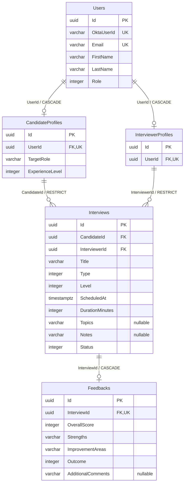

# Database ERD

Entities are shown using their PostgreSQL table names, as configured by [ApplicationDbContext](../../backend/InterviewPractice.Infrastructure/Persistence/ApplicationDbContext.cs), [entity configurations](../../backend/InterviewPractice.Infrastructure/Persistence/Configurations/), and [migrations](../../backend/InterviewPractice.Infrastructure/Persistence/Migrations/). PK = primary key; FK = foreign key; UK = unique index enforcing uniqueness.

## Relationship Explanation

- **User ↔ CandidateProfile / InterviewerProfile:** each is a one-to-one (1:1) relationship with zero-or-one profile on the User side. Each profile owns a required `UserId` foreign key; its unique constraint prevents duplicate profiles of the same type for a user. A User can retain both profile types after a role change. Deleting a User uses CASCADE toward profiles, subject to interview restrictions below.
- **CandidateProfile ↔ Interview:** one-to-many (1:N). A candidate can have zero or many interviews; each Interview has exactly one candidate through its required `CandidateId` foreign key. That FK is indexed but not unique. RESTRICT prevents deleting a profile referenced by interviews.
- **InterviewerProfile ↔ Interview:** the same 1:N cardinality through required `InterviewerId`, also indexed and non-unique with RESTRICT. This records the assigned interviewer; current Interviewer authorization is application-wide rather than restricted to this assignment.
- **Interview ↔ Feedback:** 1:1 with zero-or-one Feedback per Interview. Feedback owns required `InterviewId`; a unique constraint prevents a second feedback record for that interview. Deleting an Interview uses CASCADE to delete its Feedback.

Every table has an `Id` UUID primary key. Foreign keys enforce referential integrity. Application services assign GUIDs; no database UUID default is installed by the migrations. Candidate self-service ownership filtering uses the Interview's CandidateId resolved from the logged-in user's profile.

## CHECK Constraints and Other Integrity Rules

| Table | Database CHECK rules |
|---|---|
| Users | Role in 1,2; OktaUserId cannot consist entirely of the explicit whitespace set in the constraint. |
| CandidateProfiles | ExperienceLevel in 1–4. |
| Interviews | Type in 1–3; Level and Status in 1–4; DurationMinutes >0. |
| Feedbacks | Outcome in 1–4; OverallScore between 1 and 10. |

All attributes shown are non-null except those marked nullable. TargetRole is required in storage but may be empty. Enums are stored as integers. Users.Email and Users.OktaUserId have unique indexes. String lengths and detailed mappings are in [Persistence Architecture](../ARCHITECTURE.md#persistence-architecture).

The API's duration rule is 15–240; the database's rule remains >0. Feedback-after-completion, Cancelled-to-Completed rejection, and role/profile synchronization are Application rules, not additional foreign keys or database CHECK rules. Email normalization is performed by application writers; no normalized-email column or CHECK exists.
