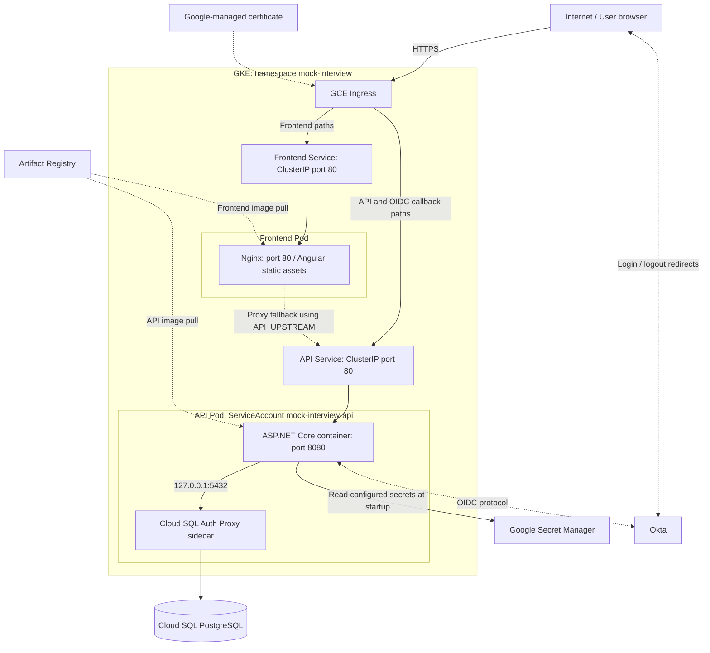

# Deployment Architecture

The diagram reflects the checked-in [Kubernetes manifests](../../k8s/). Services route to Pods; the API and Cloud SQL proxy are separate containers sharing a Pod network. The ingress routes `/api`, `/signin-oidc`, and `/signout-callback-oidc` directly to the API Service. Frontend Nginx can also proxy these paths, but it is not an extra mandatory hop for normal ingress API traffic.

Both Deployments request one replica. The hostname/certificate and Google service references are configured, not proof that those resources are currently ready. Cluster creation, external IAM bindings, DNS/static IP setup, and actual Okta callback registrations are not fully described by the manifests. See [Deployment](../DEPLOYMENT.md) for prerequisites, ports, image names, and operator commands.
