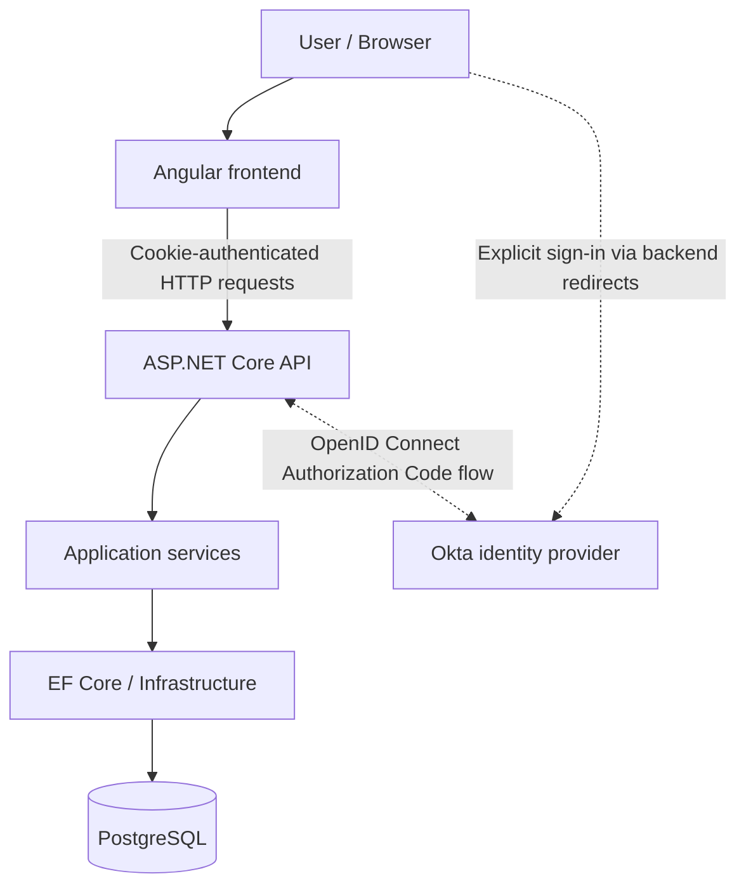

# System Overview

This is the logical request architecture, not a cloud topology. Angular presents Candidate/Interviewer features; the API authorizes requests and delegates use cases to Application services. Infrastructure implements the EF context. Authentication is managed by ASP.NET Core with an HttpOnly cookie; Angular does not implement OIDC. See [Architecture](../ARCHITECTURE.md) for actual project-reference direction and [Deployment Architecture](deployment-architecture.md) for Services, Pods, and proxies.
